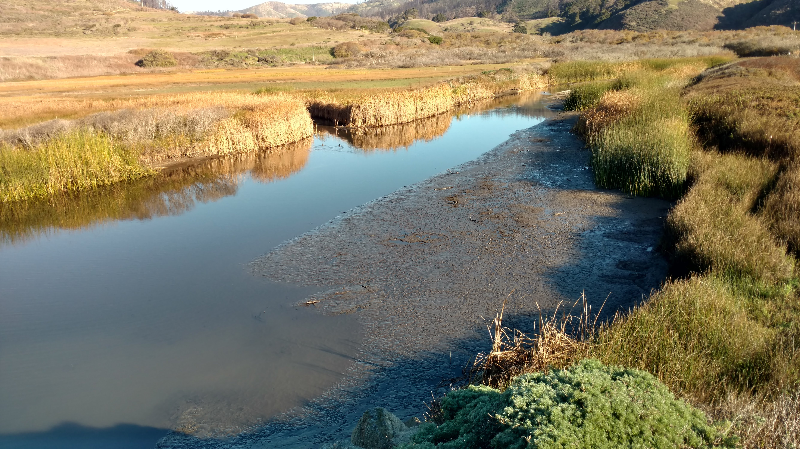

<!-- README.md is generated from README.Rmd. Please edit that file -->

```{r, echo = FALSE}
knitr::opts_chunk$set(
  collapse = TRUE,
  comment = "#>"
)
```


# Introduction

 

In August 2020, the CZU Lightning Complex fire burned more than 350 km2 (86,500 acres) of coastal forests and hills in the Santa Cruz Mountains region (Red outline in right figure; Santa Cruz and San Mateo counties, California). Among the watersheds severely affected by wildfire was Scott Creek (Yellow outline in right figure), a small (70 km2) coastal basin ~80 km south of San Francisco Bay. The Scott Creek watershed is of special management concern as it supports the southernmost extant population of coho salmon (*Oncorhynchus kisutch*; Central California Coast [CCC] evolutionarily significant unit) in North America, as well as federally threatened CCC steelhead (anadramous *O. mykiss*). Scott Creek is also the location of a salmonid life cycle monitoring station operated jointly by NOAA’s Southwest Fisheries Science Center ([FED project website](https://www.fisheries.noaa.gov/west-coast/science-data/landscape-and-seascape-ecology-research-california-salmon)) and the University of California, Santa Cruz Fisheries Collaboration Program ([FCP project website](https://fisheries.ucsc.edu/research-teams/scott-creek/)). Extensive physical, chemical, and biological monitoring conducted throughout the Scott Creek watershed since 2002 provides a unique opportunity to rigorously examine the direct and indirect effects of wildfire on salmonid productivity and carrying capacity.



Water Year 2022 (WY22) brought multiple mass wasting events and flushing flows which brough large amounts of sediment into the creek. We believe this sediment filled in pool habitat (reducing pool quantity, pool volume, and maximum pool depth). We also suspect sediment reached the Scott Creek Estuary/Lagoon; filling in areas of depth and simplifying the channel bed (right figure shows fine sediment deposition in the estuary 30 November 2021). This repository focuses on data collected in the Scott Creek Estuary/Lagoon and a separate repository is dedicated to the [pool sediment survey data](https://drive.google.com/drive/u/1/folders/1GPUKNrafZbOOjcCcR4sZtiPQt50azaap). Our goal was to survey the lagoon habitat using RTK GPS and create a bathymetric surface. Ultimately we hope to track how this habitat changes over time and answer the question "How much has the Scott Creek estuary/lagoon filled in with fine sediment compared to pre-fire conditions?". 

# Readme File Purpose
This readme file consists of an overview of the datasets, goals, and data visualizations used in the XXXX. The goal was to [Add more details here].   

<br>

# Workflow Summary

The gernal workflow is to:

1. Collect topo and echo sounder points.

2. Extract data R10s (L. Harrison helped with this) and correct raw data with OPUS correction (raw base station file submitted to OPUS and then apply correction to all points).

3. Correct echosounder points to account for WSE (instrument is partially in the water so depth needs to be added to depth points).

3. Remove bad topo points and echo points that are too shallow or have low accuracy.

4. Calculate bed surface elevation (BSE) from echosunder points (Note: topo points are corrected in step 2).

5. Calculate WSE from topo points.

6. Join topo and echosounder BSE points.

7. Convert BSE points into TIN layer(in ArcMap).

8. Convert TIN to raster layer.

9. TBD - Compair WY22 layer to ESA Dec 2016 (WY17) layer. Raster or TIN differencing. 

<br>

## Dataset Descriptions 


The <span style="color:purple">*Data*</span> folder contains the rtk datasets used... 

1. The <span style="color:purple">*XXX.csv*</span> datafile consists of XXX. 


<br>


# 1. Fieldwork Notes

On 30 August 2022, the Scott Creek crew surveyed the lagoon habitat with three RTK units (Trimble R10's). Each unit has its own raw data file (desribed above) which are used in the workflow (steps above). 

* Units: US Survey Ft. Horizontal Datum: US State Plane NAD83 CA Zone 3. Vertical Datum: Conus GEOID12A.

* Survey extent: Beach to Queseria Creek confluence. Most topo points are from the north marsh area to the beach. Echosounder points focused in main channel from the beach (downstream side of HWY 1 bridge) to Queseria Creek confluence. 

* Blue Unit - Base station.
    + Settup on ESA CP02 and ran for 8 hours (for OPUS correction). 
    + Antenna height to quick release = 4.130 ft (1.5m).
    + Job Name: Scott_blue_220830.

* Green Unit - Rover collecting topo points (water surface edge (WSE), levy, topo points.
    + Antenna height to quick release = 6.560 ft (2.0m). 
    + Shot to ESA CP01 for check point. Started topo survey at point #5.
    + Raw Data Corrections:
        + Change point code from WSE to topo for points 108,109, 163, and 164.
        + Delete points 337 and 345.
    + At point 334 we focused on WS Edge points and used a single pole (antenna height to quick release = 3.42 ft).

* Red Unit - Rover collecting echosounder points (Sonarmite; water points/ areas with depth).
    + 


