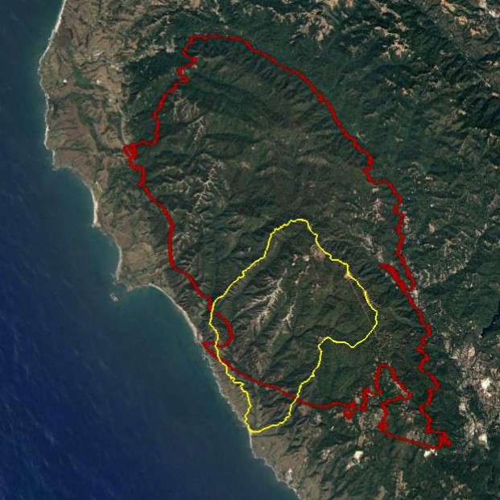

<!-- README.md is generated from README.Rmd. Please edit that file -->

```{r, echo = FALSE}
knitr::opts_chunk$set(
  collapse = TRUE,
  comment = "#>"
)
```


# Introduction

 

In August 2020, the CZU Lightning Complex fire burned more than 350 km2 (86,500 acres) of coastal forests and hills in the Santa Cruz Mountains region (Red outline in right figure; Santa Cruz and San Mateo counties, California). Among the watersheds severely affected by wildfire was Scott Creek (Yellow outline in right figure), a small (70 km2) coastal basin ~80 km south of San Francisco Bay. The Scott Creek watershed is of special management concern as it supports the southernmost extant population of coho salmon (*Oncorhynchus kisutch*; Central California Coast [CCC] evolutionarily significant unit) in North America, as well as federally threatened CCC steelhead (anadramous *O. mykiss*). Scott Creek is also the location of a salmonid life cycle monitoring station operated jointly by NOAA’s Southwest Fisheries Science Center ([FED project website](https://www.fisheries.noaa.gov/west-coast/science-data/landscape-and-seascape-ecology-research-california-salmon)) and the University of California, Santa Cruz Fisheries Collaboration Program ([FCP project website](https://fisheries.ucsc.edu/research-teams/scott-creek/)). Extensive physical, chemical, and biological monitoring conducted throughout the Scott Creek watershed since 2002 provides a unique opportunity to rigorously examine the direct and indirect effects of wildfire on salmonid productivity and carrying capacity.


Water Year 2022 (WY22) brought multiple mass wasting events and flushing flows which brough large amounts of sediment into the creek. We believe this sediment filled in pool habitat (reducing pool quantity, pool volume, and maximum pool depth). We also suspect sediment reached the Scott Creek Estuary/Lagoon; filling in areas of depth and simplifying the channel bed (right figure shows fine sediment deposition in the estuary 30 November 2021). This repository focuses on data collected in the Scott Creek Estuary/Lagoon and a separate repository is dedicated to the [pool sediment survey data](https://drive.google.com/drive/u/1/folders/1GPUKNrafZbOOjcCcR4sZtiPQt50azaap). Our goal was to survey the lagoon habitat using RTK GPS and create a bathymetric surface. Ultimately we hope to track how this habitat changes over time and answer the question "How much has the Scott Creek estuary/lagoon filled in with fine sediment compared to pre-fire conditions?". 

# Workflow Summary

The general workflow is:

1. Collect topo and echo sounder points.

2. Extract data from the R10s (L. Harrison helped with this) and correct raw data with OPUS output.

3. Correct echosounder point depths to account for "draft".

4. Remove bad topo points and echo points that are too shallow or have low accuracy.

5. Calculate bed surface elevation (BedSE) from echosunder points (Note: topo points are corrected in step 4).

6. Calculate water surface elevation (WaterSE) from echosounder points.

7. Join topo and echosounder BedSE and WaterSE points.

8. Convert BSE points into TIN layer(in ArcMap).

9. Convert TIN to raster layer (in ArcMap).

10. TBD - Compair WY22 layer to ESA Dec 2016 layer. Raster or TIN differencing (in ArcMap? or R?). 

<br>

## Dataset Descriptions 

The <span style="color:purple">*Data*</span> folder contains all of the rtk datasets used in this repository. The <span style="color:purple">*Data/Output_Data*</span> subfolder contains all of the <span style="color:blue">*corected*</span> rtk datasets.

*Uncorrected* Base Station Files:

1. The <span style="color:purple">*SC_blue_220830.csv*</span> datafile contiants the *uncorrected* base station point.

2. The <span style="color:purple">*72772420.o*</span> datafile is the *uncorrected* base station RINEX file that was submitted to OPUS for correcting.

*Uncorrected* Rover Files:

3. The <span style="color:purple">*SC_grn_220830.csv*</span> datafile consists of the *uncorrected* green rover topo points.

4. The <span style="color:purple">*SC_red_220830_withdepth.csv*</span> datafile consists of the *uncorrected* red rover topo and echosounder points. The depth field was extracted by L. Harrison using Trimble Business Center software.

<span style="color:blue">*Corrected*</span> Rover Files:

5. The <span style="color:purple">*OUT.FullDataset_Corrected_20221005*</span> datafile is the full (topo and echosounder) *corrected* dataset. This output becomes the input file in ArcMap.

<br>


# 1. Field Notes

On 30 August 2022, the Scott Creek crew surveyed the lagoon habitat with three RTK units (Trimble R10's). Each unit has its own raw data file (desribed above) which are used in the workflow (steps above). A google-drive folder with a scan of the field notebook and photos can be found [here](https://drive.google.com/drive/folders/1rpwhRYAWUH1Ks09bCyMU0wZEBVVKS9QF?usp=sharing).

Survey Notes:

* Survey Units: US Survey Ft; 

* Horizontal Datum: US State Plane NAD83 CA Zone 3

* Vertical Datum: Conus GEOID12A.

* Survey extent: Scott Creek State Beach inland to Queseria Creek confluence. Most topo points were collected from the beach to the north marsh area (bad signal starting around the Lagoon PIT antenna array). Echosounder points focused on the main channel from the beach (downstream side of Hwy 1 bridge) to Queseria Creek confluence. 

* Blue Unit - Base station.
    + Settup on ESA CP02 and ran for 8 hours (for OPUS correction). 
    + Antenna height to quick release = 4.130 ft (1.5m).
    + Job Name: sc_blue_220830.

* Green Unit - Rover collecting topo points
    + Antenna height to quick release = 6.560 ft (2.0m).
    + Job Name: sc_grn_220830.
    + Shot to ESA CP01 for check point. Found an unknown control point (code = CPX) on North Marsh near Hwy 1.
    + Started topo survey at point #5.
    + Raw Data Corrections:
        + Change point code from WSE to topo for points 108,109, 163, and 164.
        + Delete points 337 and 345.
    + At point 334 we focused on WS Edge points and used a single rod (antenna height to quick release = 3.42 ft). Note WSE points using the short rod are at the water surface but were up to 0.5 ft from the actual bank (vegitation was blocking signal so X,Y coordinates are close but not exact). 

* Red Unit - Rover collecting echosounder points (Sonarmite; wet areas with depth).
    + Antenna height to quick release = 4.130 ft.
    + Job Name: sc_red_220830.
    + Sounder depth in water (a.k.a. "Draft") = 0.650 ft
    + Started at point number 1000 with code = echo. Collected ~12,000 points.
    
* Survey Codes: 
    + levee - top of levee.
    + topo - compination of wet and dry topographic points.
    + rock - armouring at Hwy 1 bridge ("Jacks")
    + wse - Water Surface Elevation at the edge of bank (transition from wet to dry).
    + echo - wet echosounder point (need to incorperate depth measurments to elevation to get BSE).

* The North Marsh was wet during the survey (pre-fire times this was rare in the summer). Perhapse this is because the sandbar formed at a typical elevation and the lagoon was filled in with sediment so the water went on the marshplain. 

<br>

# 2. Raw Data Corrections

When starting the base station we used a "here" point; meaning we let the base station decide where it was "on the fly". The raw base station file was extracted from the base station, converted to a RINEX file (<span style="color:purple">*Data/OPUS/72772420.o*</span>) and submitted to [OPUS](https://geodesy.noaa.gov/OPUS/). A pdf of the OPUS output can be found in the Data Folder. 

OPUS Output Notes:

* The output uses the same State Plane CA Zone 3 datum as the previous survey however the output was in meters not feet. Output coordinates were reprojected in ArcMap from meters to US Survey Feet.

* The output uses GEOID18 while our survey used GEOID12A. It turns out the difference in ellipsoid height for this area is only one centemeter. So one centememter was added to the ORTHO HGT to correct for this difference (GEOID12A corrected ortho height = 8.382 meters = 27.5ft).

<span style="color:blue">**Corrections:**</span>

* OPUS Correction to apply to dataset: 
    + N_ft = Add 6.557
    + E_ft = Subtract 3.309
    + Z_ft = Subtract 2.348

<br>

* 2016 Survey Correction to apply to dataset: 
    + N_ft = Add 6.479
    + E_ft = Subtract 3.359
    + Z_ft = Subtract 1.575


```{r, eval = FALSE}

#Load packages
library(ggplot2)
library(dplyr)
library(lubridate)
library(patchwork)

options(digits = 10) #Global option so you can see the entire number for Northings and Eastings.


#### Goal: Correct raw data with OPUS correction.

#Read in RTK files
Green.dat <- read.csv('data/SC_grn_220830.csv', sep = ",", header = T) # Topo points (362 obs, 5 var).
Red.dat <- read.csv('data/SC_red_220830_withdepth.csv', sep = ",", header = T) # Echosounder points (117721 obs, 21 var).

#Make sure the data are loaded correctly
str(Green.dat)
str(Red.dat) #Looks Good.

#Correct datasets:
#Topo Points:
Green.opus <- Green.dat %>% 
  mutate(North_cor = North + 6.557,
         East_cor = East - 3.309,
         Elevation_cor = Elevation - 2.348) %>% 
  select(Point, North_cor, East_cor, Elevation_cor, Code) # 359 Obs of 5 var.
      
#Echosounder Points:
Red.opus <- Red.dat %>% 
  mutate(North_cor = North + 6.557,
         East_cor = East - 3.309,
         Elevation_cor = Elevation - 2.348) %>% # Apply OPUS correction
  select(Point, North_cor, East_cor, Elevation_cor, Depth, Code, VertPrec) #Note: Elevation and Depth are adjusted further below. # 11772 obs of 7 var.
  
  
```

<br>

# 3. Correct echosounder point depths to account for "draft".

The sounding instrument is mounted slightly into the water. This little bit of depth, known as "draft", needs to be added to all of the depth values to get total water depth (feet). The instrument depth into the water was 0.650 feet.

```{r, eval = FALSE}

#### Goal: Correct echosounder points to account for "draft".

Red.draft <- Red.opus %>% 
  mutate(Depth_cor = Depth + 0.65) %>% 
  select(-Depth) #remove raw depth column. #11772 obs of 7 var.

```


# 4. Remove bad topo points and echo points that are too shallow or have low accuracy.

```{r, eval = FALSE}

#### Goal: Correct topo and echosounder points based on field notes and echo sounder point accuracy.

#Topo points:
Green.cor <- Green.opus %>%
  mutate(BedSE = Elevation_cor) %>% #Renaming since these topos are bed surface elevation.
  select(-Elevation_cor) %>%        #Removing old named column.
  filter(Point != "BASE",
         Point != 337,
         Point != 345)  #Remove three points.

Green.cor$Code[Green.cor$Point == 7] <- "topo"
Green.cor$Code[Green.cor$Point == 108] <- "topo"
Green.cor$Code[Green.cor$Point == 109] <- "topo"
Green.cor$Code[Green.cor$Point == 163] <- "topo"
Green.cor$Code[Green.cor$Point == 164] <- "topo" #Change code form WSE to topo.

# 359 Obs of 5 var.

#Corrected topo point dataset:
# write.table(Green.cor, file = 'Data/Output_Data/OUT.Green_Corrected_20221005.csv', sep = ',', row.names = F)

#Remove echosounder points based on vertical precision threshold between 0.09 - 0.16ft and depths less than 1.3ft.
Red.cor <- Red.draft %>% 
  filter(Code == "echo",  #Remove non-echo points. #11769 obs
         VertPrec < 0.09, #Remove points based on vertical precision threshold #11067 obs
         Depth_cor > 1.3) #Remove shallow points #10977 obs

#10977 obs of 7 var.

```


# 5. Calculate bed surface elevation (BedSE) from echosounder points.

```{r, eval = FALSE}

####Goal: Combine elevations with depth to get BedSE.

Red.cor2 <- Red.cor %>%
  mutate(BedSE = Elevation_cor + Depth_cor)

#10977 obs. of 8 var.

```

# 6. Calculate water surface elevation (WaterSE) from echosounder points.

Subtract draft (0.650 ft) from rod height to get water surface elevations for the echosounder points.

```{r, eval = FALSE}

Red.cor3 <- Red.cor2 %>% 
  mutate(WaterSE = Elevation_cor - 0.65) %>% 
  select(Point, North_cor, East_cor, BedSE, WaterSE, Depth_cor, Code, VertPrec) #remove old elevation column.

#10977 obs. of 8 var.

#Corrected echosounder dataset:
# write.table(Red.cor3, file = 'Data/Output_Data/OUT.Red_Corrected_20221005.csv', sep = ',', row.names = F)

```

# 7. Join topo and echosounder BedSE and WaterSE points.

```{r, eval = FALSE}

####Goal: Join the RTK data together into a single dataset.

#Pull out topo WSE points and put them into the WaterSE column.
Green.cor.wse <- Green.cor %>%
  filter(Code == "wse") %>% 
  mutate(WaterSE = BedSE) %>% 
  select(-BedSE)#79 obs of 5 var.

Green.cor.topo <- Green.cor %>%
  filter(Code != "wse") #280 of 5 var.

Green.join <- full_join(Green.cor.topo, Green.cor.wse) #rejoin topo points #359 obs of 6 var.

RTKData <- full_join(Green.join, Red.cor3) %>% 
  select(Point, North_cor, East_cor, BedSE, WaterSE, Depth_cor, Code, VertPrec) #join topo and echosounder points #11336 obs of 8 var.

#Full corrected dataset:
# write.table(RTKData, file = 'Data/Output_Data/OUT.FullDataset_Corrected_20221005.csv', sep = ',', row.names = F)

```

# 8-10. in ArcMap (outside of R).

8. Convert BSE points into TIN layer(in ArcMap).

9. Convert TIN to raster layer (in ArcMap).

10. TBD - Compair WY22 layer to ESA Dec 2016 layer. Raster or TIN differencing (in ArcMap? or R?).


