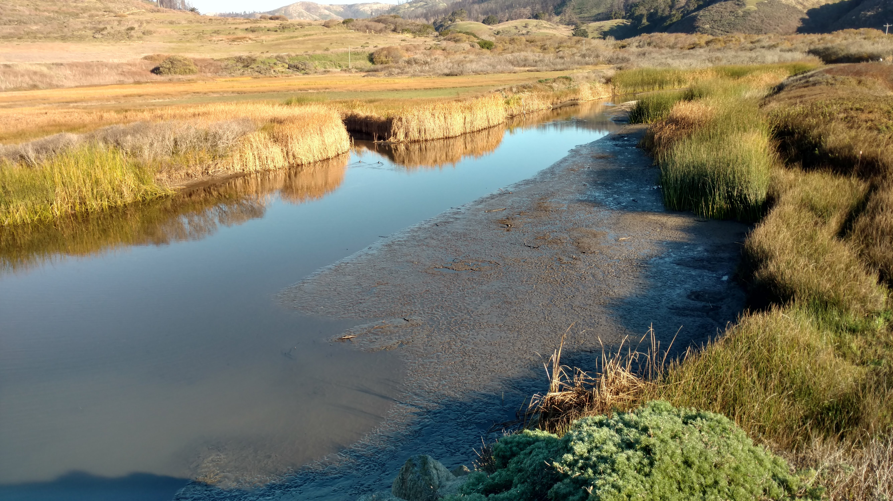

WY22 Scott Creek Lagoon Bathymetric Survey
================
03 October, 2022

-   <a href="#introduction" id="toc-introduction">Introduction</a>
-   <a href="#readme-file-purpose" id="toc-readme-file-purpose">Readme File
    Purpose</a>
-   <a href="#workflow-summary" id="toc-workflow-summary">Workflow
    Summary</a>
    -   <a href="#1-fieldwork-notes" id="toc-1-fieldwork-notes">1. Fieldwork
        Notes</a>

<!-- README.md is generated from README.Rmd. Please edit that file -->

# Introduction

In August 2020, the CZU Lightning Complex fire burned more than 350 km2
(86,500 acres) of coastal forests and hills in the Santa Cruz Mountains
region (Red outline in right figure; Santa Cruz and San Mateo counties,
California). Among the watersheds severely affected by wildfire was
Scott Creek (Yellow outline in right figure), a small (70 km2) coastal
basin \~80 km south of San Francisco Bay. The Scott Creek watershed is
of special management concern as it supports the southernmost extant
population of coho salmon (*Oncorhynchus kisutch*; Central California
Coast \[CCC\] evolutionarily significant unit) in North America, as well
as federally threatened CCC steelhead (anadramous *O. mykiss*). Scott
Creek is also the location of a salmonid life cycle monitoring station
operated jointly by NOAA’s Southwest Fisheries Science Center ([FED
project
website](https://www.fisheries.noaa.gov/west-coast/science-data/landscape-and-seascape-ecology-research-california-salmon))
and the University of California, Santa Cruz Fisheries Collaboration
Program ([FCP project
website](https://fisheries.ucsc.edu/research-teams/scott-creek/)).
Extensive physical, chemical, and biological monitoring conducted
throughout the Scott Creek watershed since 2002 provides a unique
opportunity to rigorously examine the direct and indirect effects of
wildfire on salmonid productivity and carrying capacity.

Water Year 2022 (WY22) brought multiple mass wasting events and flushing
flows which brough large amounts of sediment into the creek. We believe
this sediment filled in pool habitat (reducing pool quantity, pool
volume, and maximum pool depth). We also suspect sediment reached the
Scott Creek Estuary/Lagoon; filling in areas of depth and simplifying
the channel bed (right figure shows fine sediment deposition in the
estuary 30 November 2021). This repository focuses on data collected in
the Scott Creek Estuary/Lagoon and a separate repository is dedicated to
the [pool sediment survey
data](https://drive.google.com/drive/u/1/folders/1GPUKNrafZbOOjcCcR4sZtiPQt50azaap).
Our goal was to survey the lagoon habitat using RTK GPS and create a
bathymetric surface. Ultimately we hope to track how this habitat
changes over time and answer the question “How much has the Scott Creek
estuary/lagoon filled in with fine sediment compared to pre-fire
conditions?”.

# Readme File Purpose

This readme file consists of an overview of the datasets, goals, and
data visualizations used in the XXXX. The goal was to \[Add more details
here\].

 

**Dataset Descriptions**

The *Data* folder contains the rtk
datasets used..

1.  The *XXX.csv* datafile consists of
    XXX.

 

# Workflow Summary

## 1. Fieldwork Notes

On 30 August 2022, the Scott Creek crew surveyed the lagoon habitat with
three RTK units (Trimble R10’s).
