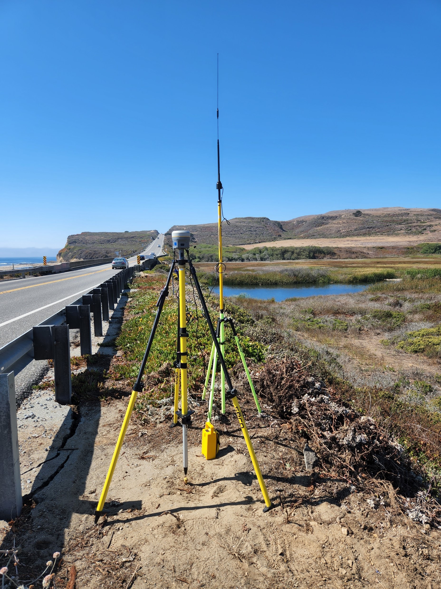
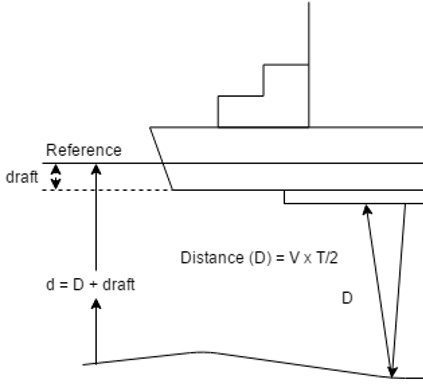
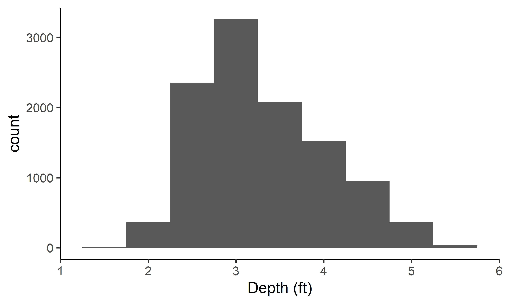

WY22 Scott Creek Lagoon Bathymetric Survey
================
07 October, 2022

-   <a href="#introduction" id="toc-introduction">Introduction</a>
-   <a href="#workflow-summary" id="toc-workflow-summary">Workflow
    Summary</a>
    -   <a href="#dataset-descriptions" id="toc-dataset-descriptions">Dataset
        Descriptions</a>
-   <a href="#1-field-notes" id="toc-1-field-notes">1. Field Notes</a>
-   <a href="#2-raw-data-corrections" id="toc-2-raw-data-corrections">2. Raw
    Data Corrections</a>
-   <a href="#3-correct-echosounder-point-depths-to-account-for-draft"
    id="toc-3-correct-echosounder-point-depths-to-account-for-draft">3.
    Correct echosounder point depths to account for “draft”.</a>
-   <a
    href="#4-remove-bad-topo-points-and-echo-points-that-are-too-shallow-or-have-low-accuracy"
    id="toc-4-remove-bad-topo-points-and-echo-points-that-are-too-shallow-or-have-low-accuracy">4.
    Remove bad topo points and echo points that are too shallow or have low
    accuracy.</a>
-   <a
    href="#5-calculate-bed-surface-elevation-bedse-from-echosounder-points"
    id="toc-5-calculate-bed-surface-elevation-bedse-from-echosounder-points">5.
    Calculate bed surface elevation (BedSE) from echosounder points.</a>
-   <a
    href="#6-calculate-water-surface-elevation-waterse-from-echosounder-points"
    id="toc-6-calculate-water-surface-elevation-waterse-from-echosounder-points">6.
    Calculate water surface elevation (WaterSE) from echosounder points.</a>
-   <a href="#7-make-corrected-output-files"
    id="toc-7-make-corrected-output-files">7. Make Corrected Output
    Files.</a>
-   <a href="#8-10-in-arcmap-outside-of-r"
    id="toc-8-10-in-arcmap-outside-of-r">8-10. in ArcMap (outside of R).</a>

<!-- README.md is generated from README.Rmd. Please edit that file -->

# Introduction

In August 2020, the CZU Lightning Complex fires burned more than 350 km2
(86,500 acres) of coastal forests and hills in the Santa Cruz Mountains
region (Santa Cruz and San Mateo counties, California). Among the
watersheds severely affected by wildfire was Scott Creek, a small (70
km2) coastal basin \~80 km south of San Francisco Bay.

<center>

<figure>

<figcaption aria-hidden="true">Fig. 1 Approximately 87% of the Scott
Creek Watershed (yellow outline) was within the CZU Lightning Complex
fire perimeter (red outline).)</figcaption>
</figure>

</center>

The Scott Creek watershed is of special management concern as it
supports the southernmost extant population of coho salmon
(*Oncorhynchus kisutch*; Central California Coast \[CCC\] evolutionarily
significant unit) in North America, as well as federally threatened CCC
steelhead (anadramous *O. mykiss*). Scott Creek is also the location of
a salmonid life cycle monitoring station operated jointly by NOAA’s
Southwest Fisheries Science Center ([FED project
website](https://www.fisheries.noaa.gov/west-coast/science-data/landscape-and-seascape-ecology-research-california-salmon))
and the University of California, Santa Cruz Fisheries Collaboration
Program ([FCP project
website](https://fisheries.ucsc.edu/research-teams/scott-creek/)).
Extensive physical, chemical, and biological monitoring conducted
throughout the Scott Creek watershed since 2002 provides a unique
opportunity to rigorously examine the direct and indirect effects of
wildfire on salmonid productivity and carrying capacity.

<center>

<figure>

<figcaption aria-hidden="true">Fig. 2 Fine sediment deposited on the
margins of the Scott Creek Estaury/Lagoon (Photo: November
2021).</figcaption>
</figure>

</center>

Water Year 2022 (WY22) had multiple mass wasting events and flushing
flows which brough large amounts of sediment into the creek. We believe
this sediment filled in pool habitat (reducing pool quantity, pool
volume, and maximum pool depth). We also suspect sediment reached the
Scott Creek Estuary/Lagoon; filling in areas of depth and simplifying
the channel bed (right figure shows fine sediment deposition in the
estuary 30 November 2021). This repository focuses on data collected in
the Scott Creek Estuary/Lagoon and a separate repository is dedicated to
the [pool sediment survey
data](https://github.com/RMBond/ScottCreek-WY22_PoolSediment). Our goal
was to survey the lagoon habitat using RTK GPS and create a bathymetric
surface. Ultimately we hope to track how this habitat changes over time
and answer the question “How much has the Scott Creek estuary/lagoon
filled in with fine sediment compared to pre-fire conditions?”.

# Workflow Summary

The general workflow is:

1.  Collect topo and echo sounder points.

2.  Extract data from the R10s (L. Harrison helped with this) and
    correct raw data with OPUS output.

3.  Correct echosounder point depths to account for “draft”.

4.  Remove bad topo points and echo points that are too shallow or have
    low accuracy.

5.  Calculate bed surface elevation (BedSE) from echosunder points
    (Note: topo points are corrected in step 4).

6.  Calculate water surface elevation (WaterSE) from echosounder points.

7.  Make Corrected Output Files.

8.  Convert BSE points into TIN layer(in ArcMap).

9.  Convert TIN to raster layer (in ArcMap).

10. TBD - Compair WY22 layer to ESA Dec 2016 layer. Raster or TIN
    differencing (in ArcMap? or R?).

<br>

## Dataset Descriptions

The <span style="color:purple">*Data*</span> folder contains all of the
rtk datasets used in this repository. The raw and output datasets can be
found in their corresponding folders.

*Uncorrected* Base Station Files:

1.  The <span style="color:purple">*SC_blue_220830.csv*</span> datafile
    contiants the *uncorrected* base station point.

2.  The <span style="color:purple">*72772420.o*</span> datafile is the
    *uncorrected* base station RINEX file that was submitted to OPUS for
    correcting.

*Uncorrected* Rover Files:

3.  The <span style="color:purple">*SC_grn_220830.csv*</span> datafile
    consists of the *uncorrected* green rover topo points.

4.  The <span style="color:purple">*SC_red_220830_withdepth.csv*</span>
    datafile consists of the *uncorrected* red rover topo and
    echosounder points. The depth field was extracted by L. Harrison
    using Trimble Business Center software.

<span style="color:blue">*OPUS Corrected*</span> Rover Files:

5.  The <span
    style="color:purple">*OUT.FullDataset_Corrected_20221007*</span>
    datafile is the full (all rtk points) *OPUS corrected* dataset. It
    can be used as a starting point for any analysis.

6.  The <span
    style="color:purple">*OUT.BedSurface_Corrected_20221007*</span>
    datafile is the *OPUS corrected* bed surface input file (topo, wse,
    and echosounder point) for making TIN and raster files in ArcMap.
    Note the WaterSE column has been removed (not needed).

7.  The <span
    style="color:purple">*OUT.WaterSurface_Corrected_20221007*</span>
    datafile is the *OPUS corrected* water surface input file (wse and
    echosounder point) for making TIN and raster files in ArcMap. Note
    the BedSE column has been removed (not needed).

<br>

# 1. Field Notes

On 30 August 2022, the Scott Creek crew surveyed the lagoon habitat with
three RTK units (Trimble R10’s). Each unit has its own raw data file
(desribed above) which are used in the workflow (steps above). A
google-drive folder with a scan of the field notebook and photos can be
found
[here](https://drive.google.com/drive/folders/1rpwhRYAWUH1Ks09bCyMU0wZEBVVKS9QF?usp=sharing).



Survey Notes:

-   Survey Units: US Survey Ft;

-   Horizontal Datum: US State Plane NAD83 CA Zone 3

-   Vertical Datum: Conus GEOID12A.

-   Survey extent: Scott Creek State Beach inland to Queseria Creek
    confluence. Most topo points were collected from the beach to the
    north marsh area (bad signal starting around the Lagoon PIT antenna
    array). Echosounder points focused on the main channel from the
    beach (downstream side of Hwy 1 bridge) to Queseria Creek
    confluence.

-   Blue Unit - Base station.

    -   Settup on ESA CP02 and ran for 8 hours (for OPUS correction).
    -   Antenna height to quick release = 4.130 ft (1.5m).
    -   Job Name: sc_blue_220830.

-   Green Unit - Rover collecting topo points

    -   Antenna height to quick release = 6.560 ft (2.0m).
    -   Job Name: sc_grn_220830.
    -   Shot to ESA CP01 for check point. Found an unknown control point
        (code = CPX) on North Marsh near Hwy 1.
    -   Started topo survey at point \#5.
    -   Raw Data Corrections:
        -   Change point code from WSE to topo for points 108,109, 163,
            and 164.
        -   Delete points 337 and 345.
    -   At point 334 we focused on WS Edge points and used a single rod
        (antenna height to quick release = 3.42 ft). Note WSE points
        using the short rod are at the water surface but were up to 0.5
        ft from the actual bank (vegitation was blocking signal so X,Y
        coordinates are close but not exact).

-   Red Unit - Rover collecting echosounder points (Sonarmite; wet areas
    with depth).

    -   Antenna height to quick release = 4.130 ft.
    -   Job Name: sc_red_220830.
    -   Sounder depth in water (a.k.a. “Draft”) = 0.650 ft
    -   Started at point number 1000 with code = echo. Collected
        \~12,000 points.

-   Survey Codes:

    -   levee - top of levee.
    -   topo - compination of wet and dry topographic points.
    -   rock - armouring at Hwy 1 bridge (“Jacks”)
    -   wse - Water Surface Elevation at the edge of bank (transition
        from wet to dry).
    -   echo - wet echosounder point (need to incorperate depth
        measurments to elevation to get BSE).

-   The North Marsh was wet during the survey (pre-fire times this was
    rare in the summer). Perhapse this is because the sandbar formed at
    a typical elevation and the lagoon was filled in with sediment so
    the water went on the marshplain.

<br>

# 2. Raw Data Corrections

When starting the base station we used a “here” point; meaning we let
the base station decide where it was “on the fly”. The raw base station
file was extracted from the base station, converted to a RINEX file
(<span style="color:purple">*Data/OPUS/72772420.o*</span>) and submitted
to [OPUS](https://geodesy.noaa.gov/OPUS/). A pdf of the OPUS output can
be found in the <span style="color:purple">*Data Folder*</span>.

OPUS Output Notes:

-   The output uses the same State Plane CA Zone 3 datum as the previous
    survey however the output was in meters not feet. Output coordinates
    were reprojected in ArcMap from meters to US Survey Feet.

-   The output uses GEOID18 while our survey used GEOID12A. It turns out
    the difference in ellipsoid height for this area is only one
    centemeter. So one centememter was added to the ORTHO HGT to correct
    for this difference (GEOID12A corrected ortho height = 8.382 meters
    = 27.5ft).

<span style="color:blue">**Corrections:**</span>

-   OPUS Correction to apply to dataset:
    -   N_ft = Add 6.557
    -   E_ft = Subtract 3.309
    -   Z_ft = Subtract 2.348

<br>

-   2016 Survey Correction to apply to dataset:
    -   N_ft = Add 6.479
    -   E_ft = Subtract 3.359
    -   Z_ft = Subtract 1.575

``` r

#Load packages
library(ggplot2)
library(dplyr)
library(lubridate)
library(patchwork)

options(digits = 10) #Global option so you can see the entire number for Northings and Eastings.


#### Goal: Correct raw data with OPUS correction.

#Read in RTK files
Green.dat <- read.csv('Data/Raw_Data/SC_grn_220830.csv', sep = ",", header = T) # Topo points (362 obs, 5 var).
Red.dat <- read.csv('Data/Raw_Data/SC_red_220830_withdepth.csv', sep = ",", header = T) # Echosounder points (11772 obs, 21 var).

#Make sure the data are loaded correctly
str(Green.dat)
str(Red.dat) #Looks Good.

#OPUS Correct datasets:
#Topo Points:
Green.opus <- Green.dat %>% 
  mutate(North_cor = North + 6.557,
         East_cor = East - 3.309,
         Elevation_cor = Elevation - 2.348) %>% 
  select(Point, North_cor, East_cor, Elevation_cor, Code) # 359 Obs of 5 var.
      
#Echosounder Points:
Red.opus <- Red.dat %>% 
  mutate(North_cor = North + 6.557,
         East_cor = East - 3.309,
         Elevation_cor = Elevation - 2.348) %>% # Apply OPUS correction
  select(Point, North_cor, East_cor, Elevation_cor, Depth, Code, VertPrec) #Note: Elevation and Depth are adjusted further below. # 11772 obs of 7 var.
  
  
```

<br>

# 3. Correct echosounder point depths to account for “draft”.



The sounding instrument is mounted slightly into the water. This little
bit of depth, known as “draft”, needs to be added to all of the depth
values to get total water depth (d in figure to the right). The draft =
0.650 feet.

``` r

#### Goal: Correct echosounder points to account for "draft".

Red.draft <- Red.opus %>% 
  mutate(Depth_cor = Depth + 0.65) %>% 
  select(-Depth) #remove raw depth column. #11772 obs of 7 var.
```

# 4. Remove bad topo points and echo points that are too shallow or have low accuracy.

Topo points were removed based on fieldnotes. Echosounder points were
removed based on a vertical precision threshold between 0.09ft and
sounding depths less than 1.3ft (the shallowest deoth a return could be
detected by the sonarmite).

``` r

#### Goal: Correct topo and echosounder points based on field notes and echo sounder point accuracy.

#Topo points:
Green.cor <- Green.opus %>%
  mutate(BedSE = Elevation_cor) %>% #Renaming since these topos are bed surface elevation.
  select(-Elevation_cor) %>%        #Removing old named column.
  filter(Point != "BASE",
         Point != 337,
         Point != 345)  #Remove three points.

Green.cor$Code[Green.cor$Point == 7] <- "topo"
Green.cor$Code[Green.cor$Point == 108] <- "topo"
Green.cor$Code[Green.cor$Point == 109] <- "topo"
Green.cor$Code[Green.cor$Point == 163] <- "topo"
Green.cor$Code[Green.cor$Point == 164] <- "topo" #Change code form WSE to topo.

# 359 Obs of 5 var.

#Corrected topo point dataset:
# write.table(Green.cor, file = 'Data/Output_Data/OUT.Green_Corrected_20221005.csv', sep = ',', row.names = F)

#Remove echosounder points based on vertical precision threshold between 0.09 - 0.16ft and depths less than 1.3ft.
Red.cor <- Red.draft %>% 
  filter(Code == "echo",  #Remove non-echo points. #11769 obs
         VertPrec < 0.09, #Remove points based on vertical precision threshold #11067 obs
         Depth_cor > 1.3) #Remove shallow points #10977 obs

#10977 obs of 7 var.
```

# 5. Calculate bed surface elevation (BedSE) from echosounder points.

BedSE is the OPUS corrected elevation plus draft corrected depth.

``` r

####Goal: Combine elevations with depth to get BedSE.

Red.cor2 <- Red.cor %>%
  mutate(BedSE = Elevation_cor + Depth_cor)

#10977 obs. of 8 var.
```

# 6. Calculate water surface elevation (WaterSE) from echosounder points.

Subtract draft (0.650 ft) from rod height to get water surface
elevations for the echosounder points. These points can be used as a
water surface elevation refrence (i.e., Z point) while wse points
collected by the green unit indicated the bank wetted margin (i.e.,
X,Y,Z )are important for creating the wetted boundary wihtin the lagoon.

``` r

Red.cor3 <- Red.cor2 %>% 
  mutate(WaterSE = Elevation_cor - 0.65) %>% 
  select(Point, North_cor, East_cor, BedSE, WaterSE, Depth_cor, Code, VertPrec) #remove old elevation column.

#10977 obs. of 8 var.

#Corrected echosounder dataset:
# write.table(Red.cor3, file = 'Data/Output_Data/OUT.Red_Corrected_20221005.csv', sep = ',', row.names = F)
```

# 7. Make Corrected Output Files.

``` r

####Goal: Join the RTK data together into a single dataset.

#Pull out topo WSE points and put them into the WaterSE column.
Green.cor.wse <- Green.cor %>%
  filter(Code == "wse") %>% 
  mutate(WaterSE = BedSE) # Make bed = water surface elevation since this is the wetted margin (used for water surface layer TIN below).
#79 obs of 6 var.

Green.cor.topo <- Green.cor %>%
  filter(Code != "wse") #280 of 5 var.

Green.join <- full_join(Green.cor.topo, Green.cor.wse) #rejoin topo points #359 obs of 6 var.

#### OUTPUT - Full Dataset Output ####
RTKData <- full_join(Green.join, Red.cor3) %>% 
  select(Point, North_cor, East_cor, BedSE, WaterSE, Depth_cor, Code, VertPrec) #join topo and echosounder points #11336 obs of 8 var.

#Full corrected dataset:
# write.table(RTKData, file = 'Data/Output_Data/OUT.FullDataset_Corrected_20221007.csv', sep = ',', row.names = F)

####  OUTPUT - Bed Surface TIN layer ####
BedData <- RTKData %>%
  filter(Code != "cp01",
         Code != "bridge",
         Code != "cb01b",
         Code != "hwymark",
         Code != "cpx") %>% #removing extra points that only matter to the base settup.
  select(North_cor, East_cor, BedSE, Code, Point, VertPrec) #Don't need these columns for bed TIN.
  
#11331 obs of 6 var.
  
#Bed Surface Points Only (Topo, echo, and wse = basic channel bed TIN for making ArcMap raster)
# write.table(BedData, file = 'Data/Output_Data/OUT.BedSurface_Corrected_20221007.csv', sep = ',', row.names = F)

####  OUTPUT - Water Surface TIN layer ####

WaterData <- RTKData %>%
  filter(Code == "wse"| Code == "echo") %>% #only water points.
  select(North_cor, East_cor, WaterSE, Code, Point, VertPrec) #11056 of 6 var.

#Water Surface Points Only (wse and echo = basic water surface TIN for visualizing depths in ArcMap raster)
# write.table(WaterData, file = 'Data/Output_Data/OUT.WaterSurface_Corrected_20221007.csv', sep = ',', row.names = F)
```

Some summaries:

``` r
#Goal: Summarise point types and range of depths.

RTKData.sum <- RTKData %>%
  filter(Code != "cp01",
         Code != "bridge",
         Code != "cb01b",
         Code != "hwymark",
         Code != "cpx") %>% 
  group_by(Code) %>% 
  summarise(n())

Depth.plot <- ggplot(RTKData, aes( x = Depth_cor)) +
  geom_histogram(binwidth = .5)+
  theme_classic() +
  scale_x_continuous("Depth (ft)", limits = c(1,6), 
                     breaks = c(1,2,3,4,5,6), 
                     labels = c(1,2,3,4,5,6),
                     expand = c(0,0))
# ggsave("Figures/Depth_Histogram_20221006.jpg", width = 5, height = 3, units = "in", dpi = 650, device = "jpg")
```

<center>

<figure>

<figcaption aria-hidden="true">Fig. X Histogram of echosounder depths
after post-processing (Min = 1.66ft, Max =5.8ft ).</figcaption>
</figure>

</center>

# 8-10. in ArcMap (outside of R).

8.  Convert BSE points into TIN layer(in ArcMap).

9.  Convert TIN to raster layer (in ArcMap).

10. TBD - Compair WY22 layer to ESA Dec 2016 layer. Raster or TIN
    differencing (in ArcMap? or R?).
